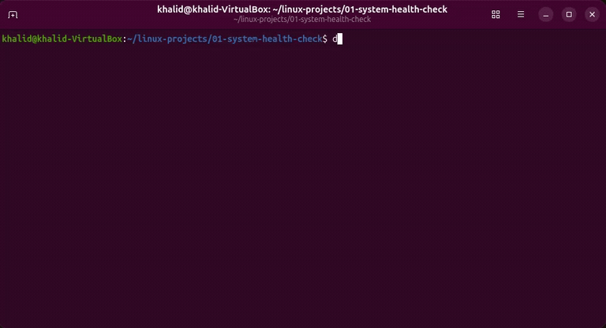

# System Health Check

A shell script that prints a quick health report for a Linux system — CPU load,
memory usage, disk usage, and the top resource-hungry processes — and flags
anything that crosses a configurable threshold.

## What it demonstrates

- Reading system state from `/proc` and standard tools (`free`, `df`, `ps`, `nproc`)
- Text processing with `awk` and parameter expansion
- Numeric and floating-point comparisons in Bash (`bc`)
- Defensive scripting with `set -euo pipefail`
- Configurable thresholds and readable, sectioned output

## Usage

```bash
# make it executable once
chmod +x health_check.sh

# run it
./health_check.sh
```

No arguments needed. Adjust the thresholds near the top of the script
(`DISK_THRESHOLD`, `MEM_THRESHOLD`, `LOAD_THRESHOLD`) to taste.

## Sample output

```
System Health Report
Host: ubuntu-vm
Date: 2026-07-15 14:32:10
Uptime: 2 hours, 5 minutes

==============================================
  CPU LOAD
==============================================
Cores: 2
Load average (1 min): 0.34
[OK]   Load is normal

==============================================
  MEMORY USAGE
==============================================
Used: 1240 MB / 3936 MB (31%)
[OK]   Memory usage normal

==============================================
  DISK USAGE
==============================================
MOUNT                     USED%    STATUS
/                         42%      [OK]
/boot                     18%      [OK]

==============================================
  TOP 5 PROCESSES (by CPU)
==============================================
  PID USER      %CPU %MEM COMMAND
  912 root       1.2  2.1 gnome-shell
 ...

Report complete.
```
## Demo for a running Docker container



## Notes

- Tested on Ubuntu 24.04 (VirtualBox).
- Requires `bc` for the load comparison: `sudo apt install bc` if it's missing.
